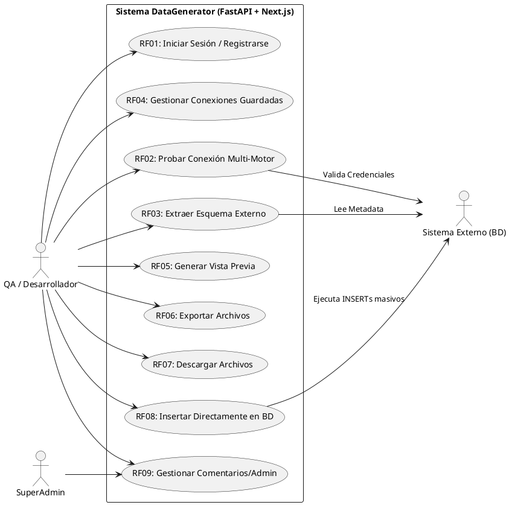
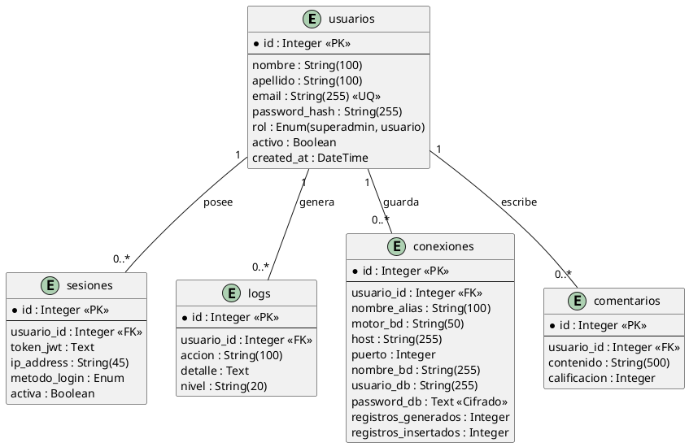
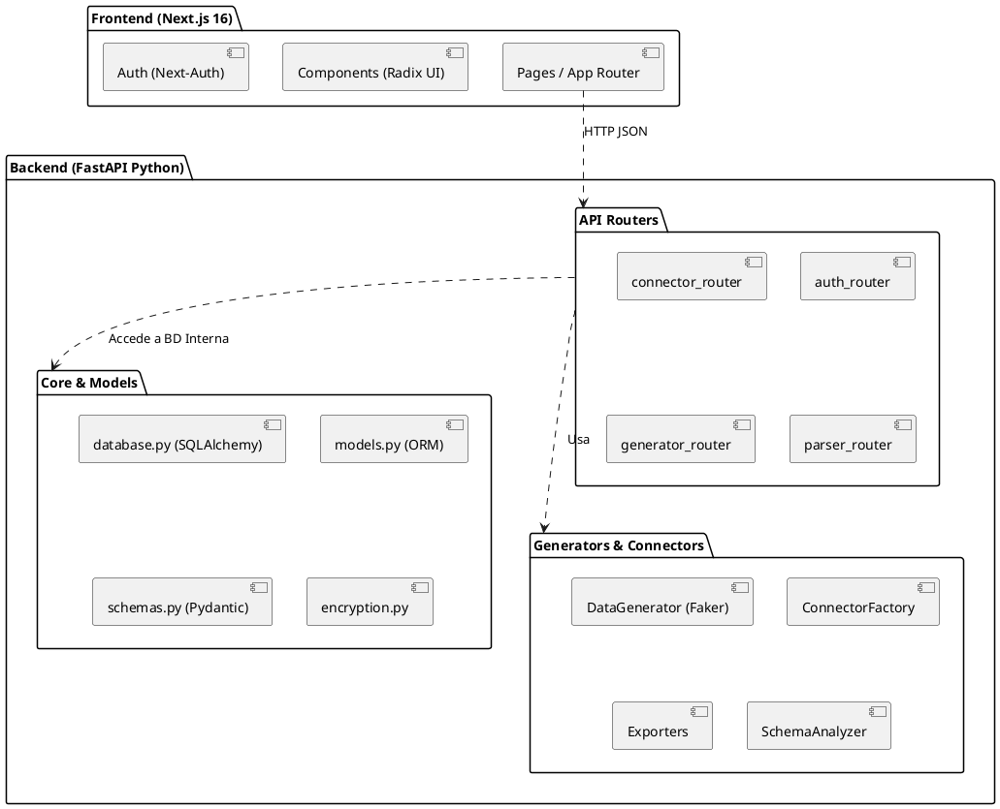
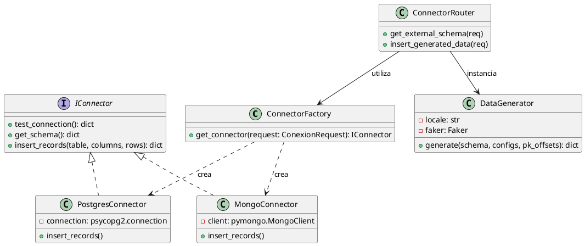
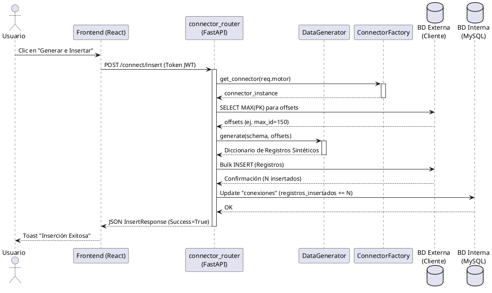

# UNIVERSIDAD PRIVADA DE TACNA
## FACULTAD DE INGENIERIA
### Escuela Profesional de Ingeniería de Sistemas

---

# Proyecto: Sistema Generador de Datos Sintéticos (DataGenerator)
**Curso:** Análisis y Diseño de Sistemas de Información  
**Docente:** Ing. Arquímedes Rodríguez Vásquez  
**Integrantes:**  
- Ramos Loza, Mariela Estefany (2023077478)  
- Calloticona Chambilla, Marymar Danytza (2023076791)  

**Tacna -- Perú**  
**2026**

---

## CONTROL DE VERSIONES
| Versión | Hecha por | Revisada por | Aprobada por | Fecha | Motivo |
|---------|-----------|--------------|--------------|-------|--------|
| 2.0 | MRL / MCC | ELV | ARV | 05/05/2026 | Actualización al Código Actual (Python/Next.js) e Inclusión de UML |

---

# Sistema DataGenerator
## Documento de Especificación de Requerimientos de Software (SRS)

## ÍNDICE GENERAL
1. [INTRODUCCIÓN](#introducción)
2. [I. GENERALIDADES DE LA EMPRESA](#i-generalidades-de-la-empresa)
3. [II. VISIONAMIENTO DE LA EMPRESA](#ii-visionamiento-de-la-empresa)
4. [III. ANÁLISIS DE PROCESOS](#iii-análisis-de-procesos)
5. [IV. ESPECIFICACIÓN DE REQUERIMIENTOS DE SOFTWARE](#iv-especificación-de-requerimientos-de-software)
   - Requerimientos Funcionales y No Funcionales
   - Diagrama de Casos de Uso
   - Especificación de Casos de Uso
   - Diagrama Entidad-Relación (ER)
   - Diagrama de Paquetes
   - Diagrama de Clases
   - Diagrama de Secuencia
   - Reglas de Negocio
6. [V. FASE DE DESARROLLO](#v-fase-de-desarrollo)
7. [CONCLUSIONES Y RECOMENDACIONES](#conclusiones)

---

# INTRODUCCIÓN
El presente documento especifica los requerimientos de software para el **Sistema de Generación de Datos Sintéticos (DataGenerator)** basado estrictamente en el código fuente actual desarrollado en **Python (FastAPI) y React (Next.js)**. Se incluyen los diagramas de ingeniería de software requeridos (Casos de Uso, Clases, Paquetes, Secuencia y ER) para modelar la arquitectura y comportamiento del sistema real, que permite no solo la exportación de datos sintéticos, sino la conexión e inserción directa en bases de datos multi-motor.

---

# I. GENERALIDADES DE LA EMPRESA
1. **Nombre de la Empresa:** TechData Solutions.
2. **Visión:** Ser la plataforma líder en generación de datos sintéticos, garantizando seguridad, cumplimiento normativo y velocidad para los equipos de QA y desarrollo a nivel global.
3. **Misión:** Proporcionar herramientas automatizadas de alto rendimiento que eliminen el uso de datos productivos en entornos de prueba, ahorrando costos y tiempo.
4. **Organigrama:** Dirección General -> Gerencia de Desarrollo (Backend Python / Frontend React) -> Gerencia de Operaciones -> Ventas.

---

# II. VISIONAMIENTO DE LA EMPRESA
### 1. Descripción del Problema
La creación manual de datos de prueba es lenta y propensa a errores. El uso de copias de producción viola leyes de privacidad de datos.
### 2. Objetivos de Negocios
- Reducir en un 80% el tiempo de preparación de datos.
- Proveer conexión en vivo a 6 motores de BD diferentes (MySQL, PostgreSQL, MongoDB, SQL Server, Neo4j, Cassandra).
### 3. Alcance del Proyecto
- **Incluye:** Autenticación JWT, extracción automática de esquemas, exportación en SQL/JSON/CSV, inserción directa a la BD destino, y encriptación de credenciales.
- **Límites:** Hasta 50,000 registros por lote.
### 4. Viabilidad
Altamente viable. Utiliza tecnologías Open Source (FastAPI, SQLAlchemy, Next.js) que garantizan concurrencia asíncrona a bajo costo de infraestructura.

---

# III. ANÁLISIS DE PROCESOS
**Proceso Actual (As-Is):** El QA solicita un script SQL al DBA -> El DBA invierte 4 horas redactando un INSERT manual -> Riesgo de errores de sintaxis -> Prueba retrasada.
**Proceso Propuesto (To-Be):** El QA ingresa a la plataforma -> Autentica -> Conecta su BD -> El sistema extrae el esquema automáticamente -> El QA genera e inserta 50,000 registros sintéticos en 5 segundos directamente en su BD.

---

# IV. ESPECIFICACIÓN DE REQUERIMIENTOS DE SOFTWARE

## A. Requerimientos Funcionales (RF)
| ID | Descripción |
|---|---|
| **RF01: Autenticación** | Registro e inicio de sesión con JWT y manejo de sesiones. |
| **RF02: Conexión Multi-Motor** | Conexión dinámica a MySQL, PostgreSQL, MongoDB, Cassandra, Neo4j y SQL Server. |
| **RF03: Extracción de Esquema** | Conexión a la BD del cliente y extracción automática de tablas, columnas y PKs. |
| **RF04: Gestión de Conexiones** | Guardar, listar y eliminar conexiones frecuentes con contraseñas cifradas. |
| **RF05: Vista Previa** | Generación de muestra de datos en vivo (Preview). |
| **RF06: Exportación** | Exportar data a archivos SQL, JSON, CSV (o ZIP). |
| **RF07: Descarga de Archivos** | Endpoint para la descarga local de exportaciones autogeneradas. |
| **RF08: Inserción Directa** | Insertar datos sintéticos directamente a la base de datos destino, calculando offsets de PK. |
| **RF09: Gestión de Comentarios** | Módulo para retroalimentación y administración. |

## B. Requerimientos No Funcionales (RNF)
| ID | Descripción Técnica |
|---|---|
| **RNF01: Stack** | Backend en Python (FastAPI/Uvicorn) y Frontend en React (Next.js 16). |
| **RNF02: Seguridad Criptográfica** | Las contraseñas de las BD externas se guardan encriptadas vía librería `cryptography`. |
| **RNF03: Asincronía** | Uso nativo de asincronía en FastAPI para no bloquear el Hilo principal en las inserciones masivas. |
| **RNF04: Modularidad ORM** | Persistencia interna usando SQLAlchemy conectada a un MySQL local. |

---

## C. Diagrama de Casos de Uso

---

## D. Especificación de Casos de Uso (Detalle)

1. **UC1 (RF01) - Iniciar Sesión:**
   - *Precondición:* Usuario no autenticado.
   - *Flujo:* Envía credenciales -> Backend valida hash con bcrypt -> Genera JWT en Sesiones.
   - *Postcondición:* Token JWT devuelto al Frontend.
2. **UC2 (RF02) - Probar Conexión:**
   - *Flujo:* Usuario ingresa Host, Puerto, Usuario, Motor. -> Backend usa el *Connector Factory* -> Test de ping.
3. **UC3 (RF03) - Extraer Esquema:**
   - *Flujo:* Si la conexión es exitosa, el *Schema Analyzer* inspecciona los metadatos de la BD (tablas, FKs) y los mapea a JSON.
4. **UC4 (RF04) - Gestionar Conexiones:**
   - *Flujo:* Guarda la conexión exitosa en la tabla interna `conexiones`, cifrando el password con Fernet. Permite listarlas u olvidarlas.
5. **UC5 (RF05) - Vista Previa:**
   - *Flujo:* El usuario ajusta reglas en la UI. El `DataGenerator` usa *Faker* para retornar 5 registros en vivo sin persistir.
6. **UC6 (RF06) - Exportar Archivos:**
   - *Flujo:* Genera N registros y el `Exporter` crea un archivo asíncrono (`aiofiles`) en el disco temporal del servidor.
7. **UC7 (RF07) - Descargar Archivos:**
   - *Flujo:* FileResponse HTTP del archivo `.sql` o `.zip` generado.
8. **UC8 (RF08) - Inserción Directa:**
   - *Flujo Crítico:* Calcula dinámicamente el `MAX(PK)` de la tabla destino en la BD Externa. Inicia inserción masiva por lotes (Bulk Insert). Actualiza contadores estadísticos en la BD interna.
9. **UC9 (RF09) - Comentarios:**
   - *Flujo:* Almacena feedback sobre la usabilidad del sistema en la tabla ORM de comentarios.

---

## E. Diagrama Entidad-Relación (Base de Datos Interna)
*Basado exactamente en el código fuente: `backend/models/models.py`*

---

## F. Diagrama de Paquetes
*Estructura modular real del código fuente.*

---

## G. Diagrama de Clases (Foco en el Motor de Conexión)

---

## H. Diagrama de Secuencia (Flujo Crítico de Inserción Directa)

---

## I. Reglas de Negocio
1. **Encriptación Obligatoria:** Ninguna contraseña de base de datos de cliente se guarda en texto plano en la BD interna. Todo pasa por `cryptography` usando variables de entorno maestras.
2. **Cálculo Inteligente de PKs:** Al insertar directamente, el sistema debe consultar primero el `MAX(ID)` en la tabla externa para evitar violaciones de clave primaria al insertar la data falsa.
3. **Validación JWT Estricta:** Todas las rutas, a excepción de las descargas directas de archivos temporales estáticos y el login, exigen dependencia `get_current_user` inyectada en FastAPI.

---

# V. FASE DE DESARROLLO (Perfiles de Usuario)
- **Desarrollador / QA:** Utiliza la plataforma a través del Frontend de Next.js para esquematizar pruebas y poblar sus bases de datos locales antes de los despliegues.
- **SuperAdmin:** Gestiona la operatividad del sistema, limpia logs y supervisa la carga en la base de datos interna mediante las APIs de administración (`admin_router`).

---

# CONCLUSIONES Y RECOMENDACIONES
- **Conclusión:** La refactorización hacia Python/FastAPI con un frontend en Next.js ha dotado al sistema de una velocidad de concurrencia y un ecosistema de librerías de datos (`Faker`, `SQLAlchemy`, drivers de BD nativos) muy superior al diseño original.
- **Recomendación:** Expandir las Pruebas Unitarias asíncronas para el módulo de inserción directa, dado que es el flujo más crítico del actual SRS.
