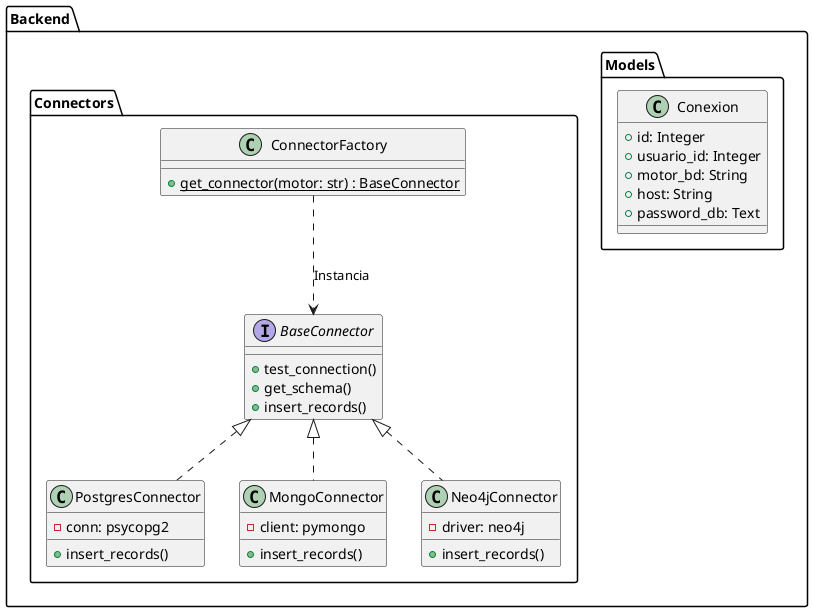

# UNIVERSIDAD PRIVADA DE TACNA
## FACULTAD DE INGENIERIA
### Escuela Profesional de Ingeniería de Sistemas

---

# Proyecto: Sistema Generador de Datos Sintéticos (DataGenerator)
**Curso:** Análisis y Diseño de Sistemas de Información  
**Docente:** Ing. Arquímedes Rodríguez Vásquez  
**Integrantes:**  
- Ramos Loza, Mariela Estefany (2023077478)  
- Calloticona Chambilla, Marymar Danytza (2023076791)  

**Tacna -- Perú**  
**2026**

---

## CONTROL DE VERSIONES
| Versión | Hecha por | Revisada por | Aprobada por | Fecha | Motivo |
|---------|-----------|--------------|--------------|-------|--------|
| 2.0 | MRL / MCC | ELV | ARV | 05/05/2026 | Actualización al Código Actual y adopción del Modelo C4 |

---

# Sistema DataGenerator
## Documento de Arquitectura de Software (SAD)

## ÍNDICE GENERAL
1. [1. Introducción](#1-introducción)
   - 1.1 Propósito
   - 1.2 Alcance
   - 1.3 Definición, Siglas y Abreviaturas
   - 1.4 Organización del Documento
2. [2. Objetivos y Restricciones Arquitectónicas](#2-objetivos-y-restricciones-arquitectónicas)
   - 2.1 Requerimientos Funcionales y su Impacto
   - 2.2 Requerimientos No Funcionales (Atributos de Calidad)
   - 2.3 Restricciones Técnicas
3. [3. Representación de la Arquitectura (Modelo C4)](#3-representación-de-la-arquitectura-modelo-c4)
   - 3.1 Nivel 1: Diagrama de Contexto
   - 3.2 Nivel 2: Diagrama de Contenedores
   - 3.3 Nivel 3: Diagrama de Componentes
   - 3.4 Nivel 4: Diagrama de Clases (Código)
4. [4. Atributos de Calidad del Software (Escenarios)](#4-atributos-de-calidad-del-software-escenarios)

---

## 1. Introducción

### 1.1 Propósito
El presente documento define la arquitectura de software del **Sistema DataGenerator**. A diferencia de iteraciones anteriores, la arquitectura actual se modela utilizando el estándar de la industria **C4 Model** (Context, Containers, Components, Code), reflejando la realidad del stack implementado en Python (FastAPI) y React (Next.js).

### 1.2 Alcance
El documento cubre toda la arquitectura del sistema, desde la interacción con los usuarios y bases de datos externas de los clientes (Nivel de Contexto) hasta el modelado detallado de los componentes de generación sintética en el backend.

### 1.3 Definición, Siglas y Abreviaturas
- **C4:** Context, Containers, Components, Code.
- **ASGI:** Asynchronous Server Gateway Interface (Uvicorn).
- **ORM:** Object-Relational Mapping (SQLAlchemy).
- **SSR:** Server-Side Rendering (Next.js).

### 1.4 Organización del Documento
El documento inicia con las decisiones arquitectónicas, y luego profundiza iterativamente a través de los cuatro niveles de abstracción (C4). Finaliza con la comprobación de atributos de calidad.

---

## 2. Objetivos y Restricciones Arquitectónicas

### 2.1 Requerimientos Funcionales y su Impacto
- **Inserción Directa en BD:** Exige un patrón "Factory" que instancie dinámicamente drivers dispares (`psycopg2`, `pymongo`, `neo4j`).
- **Autenticación Multi-Tenant:** Exige un middleware seguro de JWT y encriptación robusta (`cryptography`) para no exponer credenciales externas.

### 2.2 Requerimientos No Funcionales
- **Escalabilidad y Concurrencia:** Justifica el uso de `FastAPI` (Python) para procesamiento asíncrono no bloqueante durante la generación de miles de registros.
- **Experiencia de Usuario:** Justifica el uso de `Next.js` y `Radix UI` para una interfaz fluida e interactiva.

### 2.3 Restricciones Técnicas
- **Desacoplamiento Estricto:** El Frontend y Backend son dos servicios separados, comunicados exclusivamente por API REST + JSON.

---

## 3. Representación de la Arquitectura (Modelo C4)

El Sistema se documenta utilizando los 4 niveles de profundidad del modelo C4, utilizando PlantUML.

### 3.1 Nivel 1: Diagrama de Contexto
*Describe el sistema a vista de pájaro, mostrando a los usuarios y sus dependencias con sistemas externos.*

```plantuml
@startuml
!include https://raw.githubusercontent.com/plantuml-stdlib/C4-PlantUML/master/C4_Context.puml

Person(qa, "Usuario (QA/Dev)", "Profesional que necesita datos de prueba masivos.")
System(data_generator, "DataGenerator System", "Permite generar, exportar e insertar datos sintéticos de manera segura.")
System_Ext(db_externa, "Base de Datos Cliente", "MySQL, Postgres, Mongo, Neo4j, etc. donde se insertan los datos de prueba.")

Rel(qa, data_generator, "Configura reglas de generación, exporta o inserta datos.")
Rel(data_generator, db_externa, "Analiza esquemas e inserta data sintética masivamente.", "TCP/IP")
@enduml
```

### 3.2 Nivel 2: Diagrama de Contenedores
*Hace un zoom dentro del Sistema para ver sus contenedores de ejecución (Aplicaciones y BDs).*

```plantuml
@startuml
!include https://raw.githubusercontent.com/plantuml-stdlib/C4-PlantUML/master/C4_Container.puml

Person(user, "Usuario")
System_Boundary(c1, "DataGenerator") {
    Container(web_app, "Frontend Application", "Next.js, React, Tailwind", "Provee la interfaz de usuario interactiva SPA/SSR.")
    Container(api_app, "Backend API", "Python, FastAPI", "Orquesta la generación, autenticación y comunicación externa.")
    ContainerDb(db_interna, "Database Interna", "MySQL", "Almacena usuarios, tokens de sesión y credenciales cifradas.")
}
System_Ext(db_externa, "BD Cliente")

Rel(user, web_app, "Visita y opera", "HTTPS")
Rel(web_app, api_app, "Consume API REST", "JSON/HTTPS")
Rel(api_app, db_interna, "Lee/Escribe configuraciones", "SQLAlchemy ORM")
Rel(api_app, db_externa, "Inserta Datos", "Drivers Nativos")
@enduml
```

### 3.3 Nivel 3: Diagrama de Componentes
*Hace zoom dentro del "Backend API" para ver cómo está estructurado el código en módulos.*

```plantuml
@startuml
!include https://raw.githubusercontent.com/plantuml-stdlib/C4-PlantUML/master/C4_Component.puml

Container_Boundary(api, "Backend API (FastAPI)") {
    Component(auth_comp, "Authentication Module", "python-jose, bcrypt", "Maneja login y generación JWT.")
    Component(conn_router, "Connector Router", "FastAPI Router", "Maneja endpoints de conexiones e inserciones.")
    Component(gen_comp, "Data Generator Engine", "Faker", "Núcleo de generación de datos falsos coherentes.")
    Component(factory_comp, "Connector Factory", "Python Factory", "Instancia adaptadores según el motor solicitado.")
    Component(crypto_comp, "Encryption Core", "cryptography", "Cifra/descifra passwords de BD.")
}

ContainerDb(db_interna, "Database Interna")
System_Ext(db_externa, "BD Cliente")

Rel(auth_comp, db_interna, "Valida Hash")
Rel(conn_router, crypto_comp, "Solicita descifrado")
Rel(conn_router, factory_comp, "Solicita conector")
Rel(factory_comp, db_externa, "Devuelve Conexión Activa")
Rel(conn_router, gen_comp, "Pide datos sintéticos")
@enduml
```

### 3.4 Nivel 4: Diagrama de Clases (Code)
*El nivel más profundo. Un zoom dentro del "Connector Factory" y la Capa de Datos.*



---

## 4. Atributos de Calidad del Software (Escenarios)

El éxito de la arquitectura descrita en el Modelo C4 se somete a prueba mediante los siguientes escenarios de calidad:

### 4.1 Escenario de Rendimiento (Performance)
- **Estímulo:** El usuario solicita la generación de 50,000 registros e inserción directa en su PostgreSQL.
- **Respuesta Arquitectónica:** FastAPI recibe el requerimiento, delega la carga en un thread de generación asíncrono y utiliza los comandos de `BULK INSERT` a través de `psycopg2`.
- **Medida:** La inserción de los 50,000 registros no bloquea el event loop y toma menos de 5 segundos de CPU efectiva.

### 4.2 Escenario de Seguridad (Security)
- **Estímulo:** Un atacante logra acceder a la base de datos interna (`MySQL`).
- **Respuesta Arquitectónica:** La tabla `conexiones` almacena el campo `password_db` encriptado con Fernet simétrico, y la tabla `usuarios` almacena passwords con Hashes Bcrypt iterativos.
- **Medida:** Las credenciales de las bases de datos de los clientes se mantienen seguras y son inservibles sin la variable de entorno maestra.

### 4.3 Escenario de Extensibilidad (Mantenibilidad)
- **Estímulo:** La empresa requiere soporte para una nueva base de datos (Ej. `Oracle`).
- **Respuesta Arquitectónica:** Gracias al patrón `ConnectorFactory` en el Componente de Conexiones (Nivel 3), solo se necesita crear la clase `OracleConnector` que implemente la interfaz `BaseConnector`.
- **Medida:** El cambio no rompe ni modifica ningún `Router` ni lógica de generación, tomando menos de 1 día hábil implementar.
