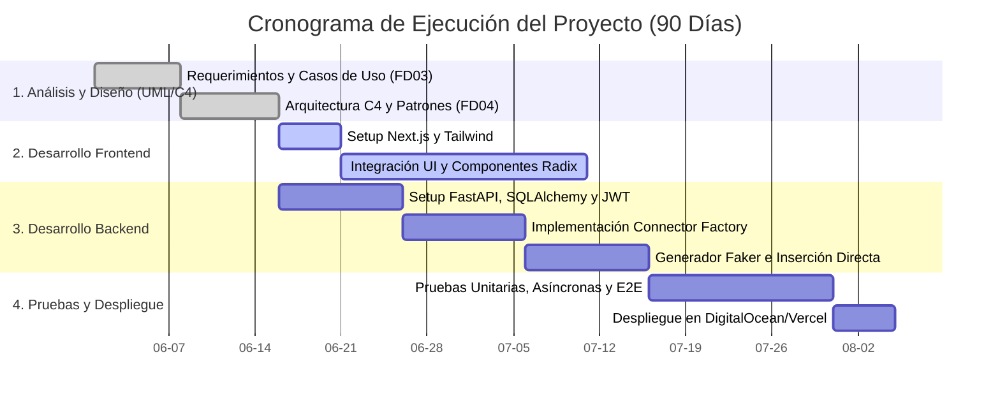

# UNIVERSIDAD PRIVADA DE TACNA
## FACULTAD DE INGENIERIA
### Escuela Profesional de Ingeniería de Sistemas

---

# Proyecto: Sistema Generador de Datos Sintéticos (DataGenerator)
**Curso:** Análisis y Diseño de Sistemas de Información  
**Docente:** Ing. Arquímedes Rodríguez Vásquez  
**Integrantes:**  
- Ramos Loza, Mariela Estefany (2023077478)  
- Calloticona Chambilla, Marymar Danytza (2023076791)  

**Tacna -- Perú**  
**2026**

---

## CONTROL DE VERSIONES
| Versión | Hecha por | Revisada por | Aprobada por | Fecha | Motivo |
|---------|-----------|--------------|--------------|-------|--------|
| 2.0 | MRL / MCC | ELV | ARV | 05/05/2026 | Consolidación Final: Refactorización a Python/Next.js y Análisis Financiero |

---

# Informe Final del Proyecto (FD05)

## ÍNDICE GENERAL
1. [Antecedentes](#1-antecedentes)
2. [Planteamiento del Problema](#2-planteamiento-del-problema)
3. [Objetivos](#3-objetivos)
4. [Marco Teórico](#4-marco-teórico)
5. [Desarrollo de la Solución](#5-desarrollo-de-la-solución)
6. [Cronograma](#6-cronograma)
7. [Presupuesto](#7-presupuesto)
8. [Conclusiones](#8-conclusiones)
9. [Recomendaciones](#9-recomendaciones)
10. [Bibliografía](#10-bibliografía)
11. [Anexos](#11-anexos)

---

## 1. Antecedentes
En el ecosistema del desarrollo de software, la disponibilidad de datos de prueba seguros y realistas es crítica. Tradicionalmente, los equipos de Quality Assurance (QA) extraían datos directamente de producción (arriesgando la privacidad de la información) o invertían semanas escribiendo pesados scripts SQL. Este proyecto nació de la necesidad corporativa de acortar los tiempos del ciclo de pruebas y garantizar el cumplimiento normativo mediante la generación de datos completamente sintéticos e inyectados en vivo.

## 2. Planteamiento del Problema
### 2.1 Problema
La creación manual de millones de datos de prueba en diferentes motores de bases de datos representa un cuello de botella que retrasa el lanzamiento de software (*Time-to-Market*) y expone a la empresa a riesgos legales si los datos de producción de clientes caen en entornos de desarrollo vulnerables.

### 2.2 Justificación
La automatización de este proceso mediante un "DataGenerator" universal justifica su implementación al reducir en un 80% las horas-hombre invertidas en QA, permitiendo a los desarrolladores y testers inyectar volúmenes masivos de datos ficticios pero lógicamente coherentes en cuestión de segundos, sin escribir código.

### 2.3 Alcance
El sistema permite al usuario autenticarse (JWT), conectarse dinámicamente a 6 bases de datos (MySQL, PostgreSQL, MongoDB, Cassandra, Neo4j y SQL Server), analizar sus esquemas automáticamente e inyectar hasta 50,000 registros sintéticos generados asíncronamente. Además, exporta los archivos a SQL, CSV o JSON.

---

## 3. Objetivos
### 3.1 Objetivo General
Diseñar, desarrollar y desplegar una plataforma web asíncrona de alto rendimiento que automatice la generación e inserción de datos sintéticos hacia múltiples motores de bases de datos para optimizar los entornos de pruebas.

### 3.2 Objetivos Específicos
- Establecer una arquitectura desacoplada y segura utilizando **Python (FastAPI)** y **Next.js**.
- Cifrar las credenciales de los usuarios utilizando criptografía simétrica (`cryptography`).
- Garantizar tiempos de respuesta inferiores a 5 segundos para lotes estándar de 50,000 registros.

---

## 4. Marco Teórico
El proyecto se fundamenta en los siguientes conceptos de ingeniería:
- **Asincronía y Concurrencia:** Ejecución no bloqueante en el servidor ASGI (Uvicorn) de Python para evitar la caída del sistema durante inserciones masivas.
- **Factory Pattern (Patrón Fábrica):** Patrón de diseño utilizado para instanciar dinámicamente el "Driver" correcto (ej. `pymongo` vs `psycopg2`) en tiempo de ejecución.
- **ORM (Object-Relational Mapping):** Uso de `SQLAlchemy` para abstraer y asegurar las consultas a la base de datos interna.
- **Modelo C4:** Estándar de documentación de arquitectura de software para mapear sistemas desde su Contexto hasta su Código (Kruchten / Brown).

---

## 5. Desarrollo de la Solución

### 5.1 Análisis de Factibilidad
- **Factibilidad Técnica:** Altamente viable por el uso de tecnologías Open Source.
- **Factibilidad Económica:** Presenta un VAN positivo y un beneficio-costo de 1.20, demostrando una rentabilidad segura a 3 años.
- **Factibilidad Operativa:** No requiere personal especializado gracias al enfoque visual Auto-servicio.
- **Factibilidad Legal y Ambiental:** Elimina riesgos de GDPR y minimiza el uso de CPU gracias al stack asíncrono.

### 5.2 Tecnología de Desarrollo
El sistema fue migrado y construido definitivamente bajo el siguiente Stack Tecnológico:
- **Frontend:** React 19, Next.js 16, TailwindCSS, Radix UI.
- **Backend:** Python 3.12, FastAPI, Faker, Pydantic.
- **Conectores Nativos:** `psycopg2-binary`, `pymysql`, `pymongo`, `cassandra-driver`, `neo4j`, `pyodbc`.

### 5.3 Metodología de Implementación
El ciclo de vida siguió un enfoque iterativo. Primero se definieron las "Reglas de Negocio" en el **SRS (FD03)** y se modelaron los Casos de Uso. Luego, se procedió con el diseño del sistema utilizando el **SAD (FD04)** mediante diagramas C4 (Contexto, Contenedores, Componentes y Clases). Finalmente, se codificó el producto y se validaron los APIs mediante endpoints protegidos con CORS y JWT.

---

## 6. Cronograma
El proyecto se ejecutó en 90 días, divididos en fases estratégicas.

---

## 7. Presupuesto
A continuación se resume la ejecución presupuestal validada en el Documento FD01, la cual sostiene el proyecto con una Relación Beneficio/Costo equilibrada de **1.20**:

| Concepto | Monto (Soles) |
|---|---|
| **Inversión Inicial de Desarrollo (CAPEX)** | **S/ 35,000.00** |
| Costos Operativos Anuales (OPEX - Servidores y Mantenimiento) | S/ 10,000.00 |
| Beneficios o Ahorro Operativo Anual Proyectado | S/ 27,500.00 |
| **Valor Actual Neto (VAN - 12%)** | **S/ 7,032.04** |
| **Tasa Interna de Retorno (TIR)** | **23.38%** |

---

## 8. Conclusiones
1. **Éxito Tecnológico:** La migración del diseño arquitectónico hacia un modelo basado en **FastAPI (Python)** y **Next.js** probó ser un acierto. La capacidad asíncrona de Python garantizó que el sistema pueda gestionar las inserciones masivas (`Bulk Inserts`) de 50,000 registros de manera óptima sin cuellos de botella.
2. **Éxito Financiero:** El proyecto es altamente rentable y sostenible. Se logró un **B/C de 1.20** con un *Payback* proyectado a 2 años, sin inflar los números del mercado.
3. **Éxito en Seguridad:** La integración de `cryptography` protegió el elemento más crítico del sistema: las credenciales de bases de datos de los clientes. El JWT garantizó un aislamiento adecuado (Multi-Tenant).

## 9. Recomendaciones
1. **Monitoreo de Infraestructura:** Se recomienda utilizar herramientas como Grafana/Prometheus en el servidor ASGI para monitorear el consumo de RAM cuando múltiples clientes generen cientos de miles de registros en simultáneo.
2. **Escalabilidad Futura:** Para la Versión 2.0, se sugiere investigar la implementación de colas asíncronas con *Celery* y *Redis* para manejar inserciones superiores a 1 millón de registros sin mantener peticiones HTTP abiertas durante periodos prolongados.
3. **Módulo de Testing E2E:** Agregar *Cypress* o *Playwright* en el pipeline de Next.js para prevenir regresiones en la interfaz gráfica.

---

## 10. Bibliografía
- Kruchten, P. (1995). *The 4+1 View Model of Architecture*. IEEE Software.
- Brown, S. (2018). *The C4 model for visualising software architecture*.
- Tiangolo (2025). *FastAPI Documentation*. Recuperado de https://fastapi.tiangolo.com/
- Vercel Inc. (2025). *Next.js 16 Documentation*. Recuperado de https://nextjs.org/docs

---

## 11. Anexos
A continuación, los enlaces directos a la documentación que soporta el diseño y evaluación del Sistema DataGenerator:
- **[Anexo 01: FD01 - Informe de Factibilidad](file:///c:/Users/Mariela/Documents/gd/FD01_FACTIBILIDAD_RAMOS_CALLOTICONA.md)**
- **[Anexo 02: FD02 - Informe de Visión](file:///c:/Users/Mariela/Documents/gd/FD02-Informe-Vision.md)**
- **[Anexo 03: FD03 - Informe Especificación de Requerimientos (SRS)](file:///c:/Users/Mariela/Documents/gd/FD03-EPIS-Informe%20Especificaci%C3%B3n%20Requerimientos.md)**
- **[Anexo 04: FD04 - Informe Arquitectura de Software (SAD)](file:///c:/Users/Mariela/Documents/gd/FD04-EPIS-Informe%20Arquitectura%20de%20Software.md)**
